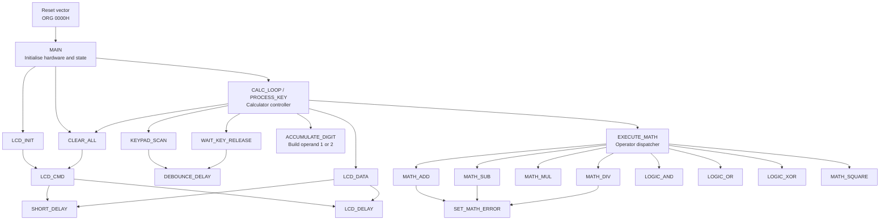
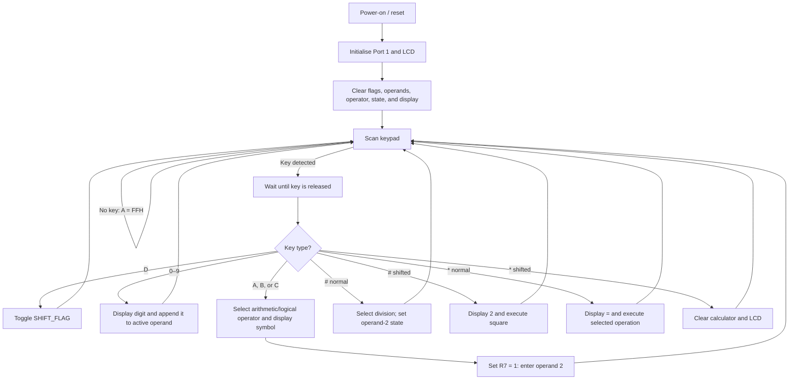

# 8051 Calculator: Structure Chart and Code Explanation

Source analysed: `Big Program V1.asm`

## 1. Program purpose

This program implements an unsigned-integer calculator on an 8051 microcontroller.

- A 4×4 matrix keypad is connected to Port 1.
- A 16×2 LCD uses Port 0 as its 8-bit data bus.
- LCD control signals use `P2.0 = RS`, `P2.1 = RW`, and `P2.2 = EN`.
- Two 16-bit operands are stored in register pairs.
- The ordinary keypad layer provides arithmetic operations.
- Pressing `D` toggles a shifted layer containing logical operations, square, and clear.

The program accepts and echoes the expression, then computes a result. As written, it does **not** convert the computed binary result back to decimal or display it on the LCD.

## 2. Data and register organisation

| Resource | Meaning |
|---|---|
| `R2:R3` | Operand 1 / result; `R2` is the high byte and `R3` is the low byte |
| `R4:R5` | Operand 2; `R4` is the high byte and `R5` is the low byte |
| `R6` | Operator code: 1 add, 2 subtract, 3 multiply, 4 divide, 5 AND, 6 OR, 7 XOR, 8 square |
| `R7` | Input state: 0 means digits go to operand 1; 1 means digits go to operand 2 |
| `20H.0` | Error flag; set after overflow, unsigned underflow, or division by zero |
| `20H.1` | Shift flag; toggled by keypad key `D` |
| `A` / `ACC` | Accumulator, keypad return value, LCD byte, and arithmetic working register |
| `B` | Second operand for the 8051 `MUL AB` and `DIV AB` instructions |
| `R0`, `R1` | Temporary arithmetic and delay-loop registers |

The notation `R2:R3` means the 16-bit value `(R2 × 256) + R3`.

## 3. Keypad map

Physical keypad layout and scan codes:

| Row | Column 0 | Column 1 | Column 2 | Column 3 |
|---|---:|---:|---:|---:|
| 0 | `1` → `01H` | `2` → `02H` | `3` → `03H` | `A` → `0AH` |
| 1 | `4` → `04H` | `5` → `05H` | `6` → `06H` | `B` → `0BH` |
| 2 | `7` → `07H` | `8` → `08H` | `9` → `09H` | `C` → `0CH` |
| 3 | `*` → `0EH` | `0` → `00H` | `#` → `0FH` | `D` → `0DH` |

Key functions:

| Key | Normal mode | Shift mode (`D` toggled on) |
|---|---|---|
| `0`–`9` | Enter a decimal digit | Enter a decimal digit |
| `A` | Addition `+` | Bitwise AND `&` |
| `B` | Subtraction `-` | Bitwise OR `|` |
| `C` | Multiplication `*` | Bitwise XOR `^` |
| `#` | Division `/` | Square operand 1 |
| `*` | Equals / execute | Clear calculator and LCD |
| `D` | Toggle shift mode | Toggle shift mode off |

## 4. Structure chart

The chart below is a module hierarchy: a downward arrow means that the upper routine calls or dispatches to the lower routine.



## 5. Main control flow



## 6. Detailed code explanation

### 6.1 Reset vector and `MAIN`

```asm
ORG 0000H
SJMP MAIN
```

- `ORG 0000H` places the next instruction at the 8051 reset-vector address.
- After reset, `SJMP MAIN` skips directly to the program initialisation code.

```asm
MOV P1, #0FFH
ACALL LCD_INIT
CLR 20H.0
CLR 20H.1
ACALL CLEAR_ALL
```

- Writing `FFH` to Port 1 releases all quasi-bidirectional pins so that the keypad columns can be read.
- `LCD_INIT` configures the LCD.
- Both the error and shift flags are cleared.
- `CLEAR_ALL` zeros both operands, the operator, and the operand-selection state, then clears the LCD.

There is no `RET` after `MAIN`; execution naturally continues into `CALC_LOOP`.

### 6.2 `CALC_LOOP` and key release handling

```asm
ACALL KEYPAD_SCAN
CJNE A, #0FFH, PROCESS_KEY
SJMP CALC_LOOP
```

- `KEYPAD_SCAN` returns a scan code in `A`.
- `FFH` is the sentinel meaning “no key”.
- A real key branches to `PROCESS_KEY`; otherwise the program polls again.

```asm
PUSH ACC
ACALL WAIT_KEY_RELEASE
POP ACC
```

- The scan code is pushed because `WAIT_KEY_RELEASE` uses and changes `A`.
- The routine waits for all columns to return high, preventing a held key from being processed repeatedly.
- `POP ACC` restores the original scan code.

### 6.3 Shift-key handling

```asm
CJNE A, #0DH, CHECK_DIGIT
CPL 20H.1
SJMP CALC_LOOP
```

- `0DH` is the code for key `D`.
- `CPL` complements the shift bit: 0 becomes 1 and 1 becomes 0.
- No character is printed for the shift key.

### 6.4 Digit test, display, and storage

```asm
CJNE A, #0AH, $ + 3
JNC CHECK_OPERATOR
```

This is a compact unsigned comparison. `CJNE` sets carry when `A < 0AH`. Its branch target, `$ + 3`, is the following instruction, so the branch itself does not change the visible path; its important job is setting carry. `JNC` therefore jumps to operator handling when `A >= 10`. Values `0` through `9` fall through as digits.

```asm
PUSH ACC
ADD A, #30H
ACALL LCD_DATA
POP ACC
ACALL ACCUMULATE_DIGIT
```

- The numeric value is saved.
- Adding `30H` converts `0`–`9` to ASCII `'0'`–`'9'`.
- `LCD_DATA` echoes the digit.
- The raw digit is restored and appended to the current operand.

### 6.5 Operator selection

The labels `CHECK_OPERATOR`, `TRY_B`, `TRY_C`, `TRY_HASH`, and `TRY_STAR` form an if/else-if chain.

For keys `A`, `B`, and `C`, the shift flag chooses between two meanings:

```asm
CJNE A, #0AH, TRY_B
JB 20H.1, SET_AND
MOV R6, #01H
MOV A, #'+'
ACALL LCD_DATA
SJMP NEXT_OPERAND
```

- If the key is not `A`, test key `B` next.
- `JB 20H.1, SET_AND` selects AND when shift mode is active.
- Otherwise, operator code 1 is stored for addition and `+` is displayed.

The remaining pairs use the same pattern:

- `B`: `R6 = 02H` and `-`, or shifted `R6 = 06H` and `|`.
- `C`: `R6 = 03H` and `*`, or shifted `R6 = 07H` and `^`.
- `#`: `R6 = 04H` and `/`, or shifted `R6 = 08H` and immediate square execution.

`DO_SQUARE` displays only the character `2`, calls `EXECUTE_MATH`, and returns to the calculator loop. The display therefore resembles `x2`, not a superscript expression.

For key `*`:

- Normal mode displays `=` and calls `EXECUTE_MATH`.
- Shift mode enters `DO_CLEAR`, clears both flags, resets the registers, and clears the LCD.

```asm
NEXT_OPERAND:
    MOV R7, #01H
    SJMP CALC_LOOP
```

After a binary operator, `R7 = 1` directs all later digits to operand 2.

### 6.6 `CLEAR_ALL`

```asm
MOV R2, #00H
MOV R3, #00H
MOV R4, #00H
MOV R5, #00H
MOV R6, #00H
MOV R7, #00H
MOV A, #01H
ACALL LCD_CMD
RET
```

- `R2:R3` and `R4:R5` become zero.
- The stored operator is removed.
- Input returns to operand 1.
- LCD command `01H` clears the screen and returns its cursor home.
- This routine does not itself clear `ERR_FLAG` or `SHIFT_FLAG`; callers do that separately when required.

### 6.7 LCD routines

`LCD_INIT` sends three standard HD44780-compatible commands:

| Command | Purpose |
|---|---|
| `38H` (`00111000B`) | 8-bit interface, two display lines, 5×7/5×8 character format |
| `0CH` (`00001100B`) | Display on, cursor off, blinking off |
| `06H` (`00000110B`) | Increment cursor after each character; do not shift display |

`LCD_CMD` writes the byte in `A` as a command:

```asm
MOV P0, A
CLR P2.0
CLR P2.1
SETB P2.2
ACALL SHORT_DELAY
CLR P2.2
ACALL LCD_DELAY
```

- Port 0 receives the command byte.
- `RS = 0` selects the instruction register.
- `RW = 0` selects a write cycle.
- `EN` is pulsed high and then low; the falling edge latches the byte.
- A longer fixed delay allows the LCD controller to finish.

`LCD_DATA` is the same electrical transaction except `RS = 1`, which selects the LCD data register and prints a character.

`SHORT_DELAY` executes two `NOP` instructions before returning. `LCD_DELAY` uses nested `DJNZ` loops. It pushes direct RAM addresses `00H` and `01H`, which are register-bank-0 locations for `R0` and `R1`, so the delay does not corrupt the caller’s temporary registers.

### 6.8 `KEYPAD_SCAN`

Initial detection:

```asm
MOV P1, #0F0H
MOV A, P1
ANL A, #0F0H
CJNE A, #0F0H, KEY_FOUND
MOV A, #0FFH
RET
```

- The low nibble, connected to rows, is driven low.
- The high nibble, connected to columns, is written high and read as input.
- With no key pressed, all column bits remain high and the masked value is `F0H`.
- A pressed key connects a low row to a column, causing at least one upper bit to read zero.

`KEY_FOUND` calls the debounce delay and repeats the check. If the key is no longer present, it returns `FFH`, treating the first detection as noise.

The four row scans write these patterns:

| Pattern | Selected row | Reason |
|---|---:|---|
| `FEH` | 0 | Bit 0 is low |
| `FDH` | 1 | Bit 1 is low |
| `FBH` | 2 | Bit 2 is low |
| `F7H` | 3 | Bit 3 is low |

For each selected row, `JNB ACC.4` through `JNB ACC.7` test the four columns. `JNB` means “jump if this bit is not set,” so a zero column bit identifies the pressed key. The `GOT_KEY_*` labels place the corresponding code `00H`–`0FH` in `A` and return.

### 6.9 `WAIT_KEY_RELEASE` and `DEBOUNCE_DELAY`

`WAIT_KEY_RELEASE` drives every row low and repeatedly reads the upper nibble until it equals `F0H`. It then delays once more to debounce the release edge.

`DEBOUNCE_DELAY` is a nested `DJNZ` delay, but both counters are initialised to 1. Consequently each loop executes only once. On a real 8051 this delay is extremely short and is unlikely to provide useful mechanical-key debounce.

### 6.10 `ACCUMULATE_DIGIT`

The decimal update is:

```text
new operand = old operand × 10 + entered digit
```

`CJNE R7, #00H, ACC_OP2` selects operand 1 when `R7 = 0`, otherwise operand 2.

For operand 1, the routine performs a 16-bit-by-10 operation in pieces:

1. `R3 × 10` is calculated with `MUL AB`; its low byte goes back to `R3`, and its high byte is saved in `R0`.
2. `R2 × 10` is calculated; only its low byte can fit into the new 16-bit high byte.
3. The carry byte from the low-byte multiplication (`R0`) is added to the new high byte.
4. The saved digit is popped and added to `R3`.
5. `ADDC` adds any carry from the low-byte digit addition to `R2`.

`ACC_OP2` repeats the exact algorithm for `R4:R5`.

No overflow check is performed while entering digits, so a number larger than 65535 silently wraps modulo 65536.

### 6.11 `EXECUTE_MATH`

This routine is an operator dispatcher. It compares `R6` with each operator code and calls exactly one implementation:

| `R6` | Called routine | Operation |
|---:|---|---|
| `01H` | `MATH_ADD` | Unsigned addition |
| `02H` | `MATH_SUB` | Unsigned subtraction |
| `03H` | `MATH_MUL` | Multiplication |
| `04H` | `MATH_DIV` | Division |
| `05H` | `LOGIC_AND` | Bitwise AND |
| `06H` | `LOGIC_OR` | Bitwise OR |
| `07H` | `LOGIC_XOR` | Bitwise XOR |
| `08H` | `MATH_SQUARE` | Square |

If `R6` is zero or an unknown value, the chain reaches `MATH_DONE` and returns without doing anything.

### 6.12 `MATH_ADD`

```asm
MOV A, R3
ADD A, R5
MOV R3, A
MOV A, R2
ADDC A, R4
MOV R2, A
JC SET_MATH_ERROR
```

- Low bytes are added first.
- `ADDC` includes the low-byte carry when adding the high bytes.
- A carry out of the high byte means the unsigned result exceeded 65535, so the error routine is entered.
- The 16-bit result replaces operand 1 in `R2:R3`.

### 6.13 `MATH_SUB`

- `CLR C` removes any old borrow.
- `SUBB` subtracts the low bytes, then the high bytes including any low-byte borrow.
- Carry after the high-byte subtraction represents an unsigned borrow, meaning operand 2 was greater than operand 1.
- A negative result is therefore treated as an error; signed results are not supported.

### 6.14 `MATH_MUL`

```asm
MOV A, R3
MOV B, R5
MUL AB
MOV R3, A
MOV R2, B
```

The 8051 multiplies two 8-bit values and returns a 16-bit result in `B:A`. This implementation multiplies only the low bytes `R3 × R5`; it ignores `R2` and `R4`. It is therefore correct only when both operands are in the range 0–255.

### 6.15 `MATH_DIV`

- `MOV A, R5` followed by `JZ` detects a zero low-byte divisor.
- `DIV AB` divides `R3` by `R5`; quotient is returned in `A` and remainder in `B`.
- The quotient is stored in `R3`, `R2` is cleared, and the remainder is discarded.

Only the low bytes are used. A divisor such as 256 (`R4:R5 = 0100H`) is incorrectly diagnosed as zero because `R5 = 0`, and a dividend above 255 is truncated to its low byte.

### 6.16 Logical routines

`LOGIC_AND`, `LOGIC_OR`, and `LOGIC_XOR` execute `ANL`, `ORL`, or `XRL` on `R3` and `R5`. The result is stored in `R3`, `R2` is cleared, and shift mode is turned off.

These are 8-bit operations even though input accumulation supports 16-bit values; the operand high bytes are ignored.

### 6.17 `MATH_SQUARE`

`MATH_SQUARE` loads the low byte of operand 1 into both `A` and `B`, executes `MUL AB`, and stores the 16-bit product in `R2:R3`. It also clears shift mode. The square is correct only for an operand from 0 to 255 because the original high byte is ignored.

### 6.18 `SET_MATH_ERROR`

```asm
SETB 20H.0
MOV R2, #0EEH
MOV R3, #0EEH
RET
```

- The error flag is set.
- Operand 1 / result is replaced by the marker `EEEEH`.
- The routine returns directly to the caller of the arithmetic routine.

The program never checks `ERR_FLAG` after setting it and has no error-display routine, so the user receives no visible `Error` message.

### 6.19 `END`

`END` is an assembler directive marking the end of the source file. It is not an instruction executed by the 8051.

## 7. Important behaviour and limitations

1. **The result is not displayed.** `EXECUTE_MATH` changes `R2:R3`, but there is no binary-to-decimal conversion and no later call to `LCD_DATA` for the result.
2. **Input is 16-bit, but most operations are 8-bit.** Multiply, divide, AND, OR, XOR, and square use only the low operand bytes.
3. **Digit-entry overflow is silent.** Values above 65535 wrap around.
4. **Errors are invisible.** `ERR_FLAG` and `EEEEH` are set but never printed.
5. **Debouncing is effectively absent.** A `1 × 1` nested delay is much too short for most physical keypads.
6. **Only unsigned arithmetic is supported.** Subtraction that would produce a negative value becomes an error.
7. **Division discards the remainder.** Only an 8-bit quotient is retained.
8. **The expression remains editable after execution.** The program does not reset `R7`, operands, or operator after `=`, so subsequent digits continue to modify operand 2 until the user clears the calculator.

## 8. Common 8051 instructions used

| Instruction | Meaning in this program |
|---|---|
| `MOV destination, source` | Copy a byte; source is unchanged |
| `ACALL label` | Call a subroutine within the same 2 KB code page |
| `RET` | Return from a subroutine |
| `SJMP label` | Short relative jump |
| `CJNE x, y, label` | Compare and jump if unequal; also sets carry for unsigned less-than |
| `JB bit, label` | Jump if a bit equals 1 |
| `JNB bit, label` | Jump if a bit equals 0 |
| `JNC label` | Jump when carry equals 0 |
| `JZ label` | Jump when accumulator equals zero |
| `DJNZ x, label` | Decrement and jump if the result is not zero |
| `PUSH` / `POP` | Save to / restore from the stack |
| `ADD` / `ADDC` | Add without / with carry |
| `SUBB` | Subtract with borrow |
| `MUL AB` | Unsigned 8-bit × 8-bit multiplication; result in `B:A` |
| `DIV AB` | Unsigned `A ÷ B`; quotient in `A`, remainder in `B` |
| `ANL` / `ORL` / `XRL` | Bitwise AND / OR / XOR |
| `CLR` / `SETB` / `CPL` | Clear, set, or toggle a bit |
| `NOP` | Do nothing for one instruction cycle |
| `ORG` / `END` | Assembler directives, not runtime instructions |

